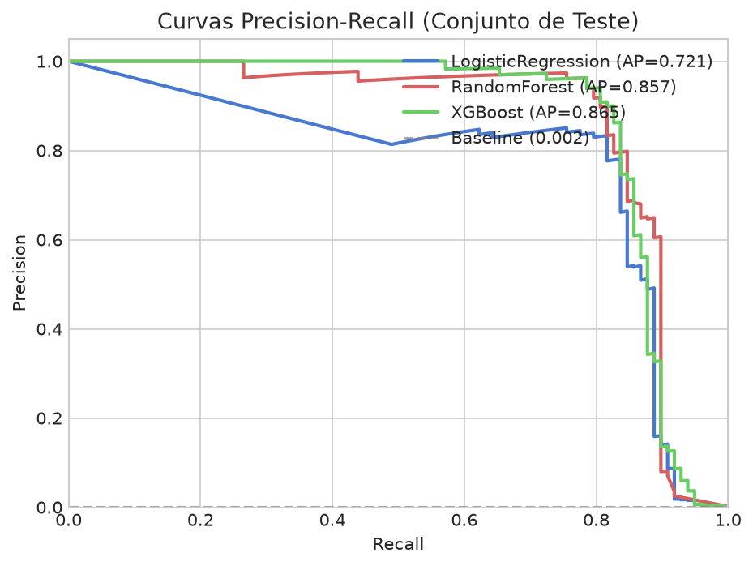
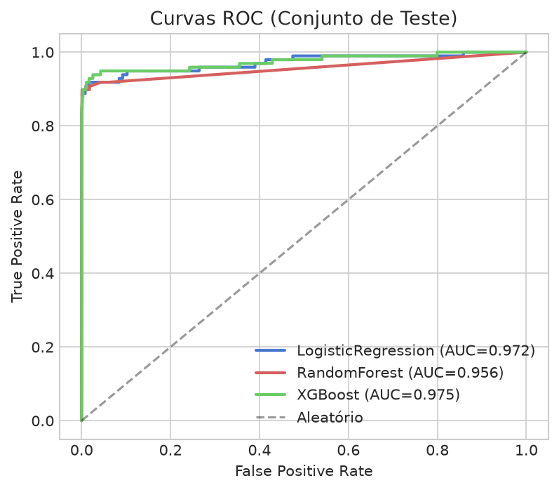
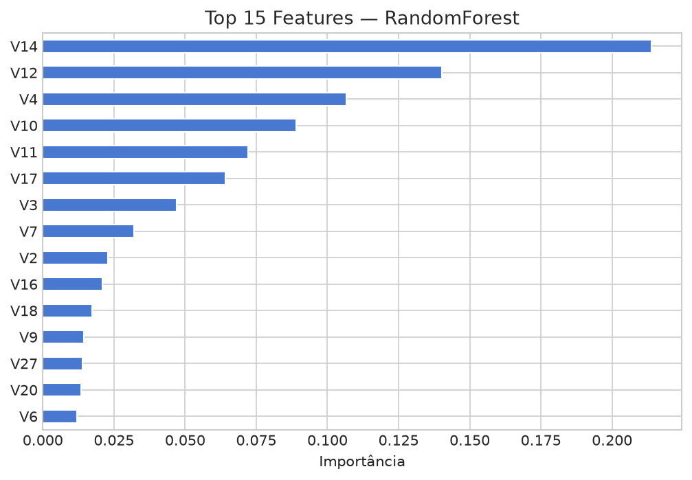
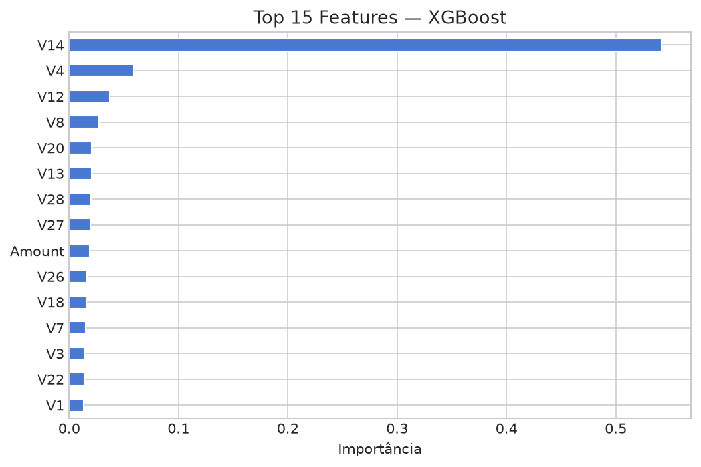
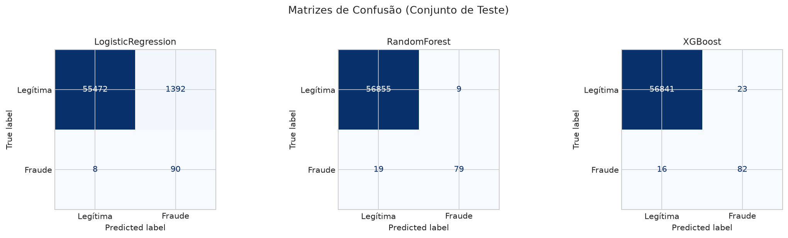

# Detecção de Fraude em Cartões de Crédito com Aprendizado de Máquina: Uma Comparação de Classificadores em Dados Altamente Desbalanceados

**Disciplina:** Machine Learning — **Professor:** Mateus Silva  
**Instituição:** FACAPE

## Integrantes

| Nome | E-mail |
|---|---|
| João Pedro Jacó Leite | joao.j.leite.25336@aluno.facape.br |
| Lucas Arlégo Tavares Cavalcanti | lucas.cavalcanti.22623@aluno.facape.br |
| Igor Macêdo da Silva Santos | igor.s.santos.24751@aluno.facape.br |
| José Davidson Lopes Pimentel Júnior | jose.p.junior.24609@aluno.facape.br |
| Icaro Joel Moura Pinto | icaro.pinto.25346@aluno.facape.br |

---

## Resumo

A detecção automatizada de fraudes em transações financeiras é um problema de classificação binária com desafio central no severo desequilíbrio de classes. Este trabalho aplica e compara três classificadores supervisionados — Regressão Logística, Random Forest e XGBoost — ao dataset público de fraudes em cartões de crédito do Kaggle (284.807 transações, 0,17% de fraudes). Adotamos *Average Precision* (AUC-PR) como métrica primária, validação cruzada estratificada com 5 folds e ajuste de hiperparâmetros via GridSearchCV sem contaminação do conjunto de teste. Os resultados demonstram que modelos ensemble superam a regressão logística em todas as métricas: XGBoost obteve AUC-PR de 0,8652 e Random Forest F1 de 0,8495 no conjunto de teste, contra AUC-PR de 0,7205 da regressão logística. O teste de McNemar entre os dois melhores modelos indicou diferença estatisticamente significativa (p = 0,027).

**Palavras-chave:** detecção de fraude, aprendizado de máquina, dados desbalanceados, AUC-PR, XGBoost.

---

## 1. Introdução

Fraudes em cartões de crédito causam prejuízos anuais superiores a 30 bilhões de dólares globalmente (Nilson Report, 2023). A automação da detecção é essencial: transações ocorrem em milissegundos e a revisão manual é inviável em escala. O problema é inerentemente de classificação binária, mas com característica crítica: a classe de interesse (fraude) representa menos de 0,2% dos dados, criando um desbalanceamento extremo.

Modelos treinados sem atenção a este desbalanceamento tendem a classificar toda transação como legítima, obtendo acurácia aparente de 99,8% sem detectar qualquer fraude. Métricas como acurácia tornam-se enganosas; métricas como AUC-PR (Area Under the Precision-Recall Curve) são mais informativas neste contexto (Davis & Goadrich, 2006).

Este trabalho realiza um estudo comparativo de três algoritmos de classificação no dataset público de fraudes em cartões de crédito da ULB (Dal Pozzolo et al., 2015), com foco em (1) reprodutibilidade metodológica, (2) prevenção de vazamento de dados, e (3) interpretação estatística dos resultados.

---

## 2. Metodologia

### 2.1 Dataset

O dataset contém 284.807 transações realizadas por titulares europeus de cartões de crédito em setembro de 2013. Por razões de confidencialidade, as features originais foram transformadas por PCA, gerando 28 componentes (V1–V28). As únicas features com escala original são `Time` (segundos desde a primeira transação) e `Amount` (valor em EUR). A variável alvo é `Class` (0 = legítima, 1 = fraude). Não há valores nulos.

**Distribuição de classes:** 284.315 legítimas (99,827%) e 492 fraudes (0,173%).

### 2.2 Divisão Treino/Teste

Realizamos divisão estratificada 80/20 (`random_state=42`) antes de qualquer transformação, preservando a proporção de fraudes em ambos os conjuntos. O conjunto de teste foi utilizado exclusivamente na avaliação final.

### 2.3 Pré-processamento

As features V1–V28 são componentes PCA já padronizados. Aplicamos `StandardScaler` apenas em `Amount` e `Time`, embutindo o scaler em um `Pipeline` do scikit-learn para garantir que o ajuste ocorra exclusivamente nos dados de treino de cada fold de validação cruzada, prevenindo vazamento de dados (data leakage).

### 2.4 Modelos

Treinamos três classificadores distintos:

1. **Regressão Logística (LR):** modelo linear baseline com solver `liblinear`. Hiperparâmetro ajustado: regularização `C ∈ {0,1; 1; 10}`, melhor valor: `C = 10`. `class_weight='balanced'` para compensar o desbalanceamento.

2. **Random Forest (RF):** ensemble de árvores de decisão. Hiperparâmetros ajustados: `n_estimators = 100`, `max_depth ∈ {10, 20}`, melhor configuração: `max_depth = 20`. `class_weight='balanced'`.

3. **XGBoost:** gradient boosting com regularização. Hiperparâmetros ajustados: `max_depth ∈ {3, 6}`, `learning_rate ∈ {0,05; 0,1}`, `n_estimators = 100`. Melhor configuração: `max_depth = 6`, `learning_rate = 0,1`. `scale_pos_weight` = razão negativo/positivo no treino (~578).

O tratamento do desbalanceamento via `class_weight`/`scale_pos_weight` foi preferido a SMOTE para evitar a necessidade de re-amostragem intra-fold, que aumenta a complexidade do pipeline sem garantia de melhoria em dados PCA (He & Garcia, 2009).

### 2.5 Validação e Ajuste de Hiperparâmetros

Utilizamos `GridSearchCV` com `StratifiedKFold(n_splits=5, shuffle=True, random_state=42)` para ajuste de hiperparâmetros, otimizando `average_precision` (AUC-PR). Após seleção do melhor conjunto de hiperparâmetros, realizamos validação cruzada adicional com os melhores modelos para estimar média e desvio-padrão das métricas.

### 2.6 Métricas de Avaliação

**Métrica primária:** AUC-PR (*Average Precision*) — área sob a curva Precision-Recall. É preferível ao AUC-ROC em dados altamente desbalanceados pois não infla o score com os verdadeiros negativos abundantes (Davis & Goadrich, 2006).

**Métricas secundárias:** F1-score, AUC-ROC, Precisão e Revocação.

**Teste estatístico:** Teste de McNemar entre os dois melhores modelos. Compara as predições de dois classificadores no mesmo conjunto de teste, sendo mais adequado que t-test para comparações de classificadores pareados (Dietterich, 1998).

---

## 3. Resultados

### 3.1 Validação Cruzada

Os resultados de validação cruzada (5 folds, conjunto de treino) estão apresentados na Tabela 1.

**Tabela 1 — Resultados de Validação Cruzada (média ± desvio-padrão, 5 folds estratificados)**

| Modelo | AUC-PR | F1 | AUC-ROC |
|---|---|---|---|
| Logistic Regression | 0,7454 ± 0,0529 | 0,1174 ± 0,0062 | 0,9825 |
| Random Forest | 0,8408 ± 0,0199 | 0,8377 ± 0,0180 | 0,9666 |
| XGBoost | 0,8273 ± 0,0196 | 0,8136 ± 0,0196 | 0,9783 |

*Ver `experiments/experiments.csv` para registro completo dos experimentos.*

### 3.2 Avaliação no Conjunto de Teste

**Tabela 2 — Métricas no Conjunto de Teste (n = 56.962 transações, 98 fraudes)**

| Modelo | AUC-PR | F1 | AUC-ROC | Precision | Recall |
|---|---|---|---|---|---|
| Logistic Regression | 0,7205 | 0,1139 | 0,9721 | 0,0607 | 0,9184 |
| Random Forest | 0,8567 | **0,8495** | 0,9561 | 0,8977 | 0,8061 |
| **XGBoost** | **0,8652** | 0,8079 | **0,9747** | 0,7810 | 0,8367 |

*Ver `article/tables/model_comparison.md` para tabela gerada pelo pipeline.*

### 3.3 Curvas Precision-Recall e ROC

As Figuras 1 e 2 apresentam as curvas Precision-Recall e ROC dos três modelos no conjunto de teste. A linha tracejada na curva PR representa o baseline aleatório (prevalência da classe positiva).

*Figura 1: Curvas Precision-Recall dos três modelos no conjunto de teste.*

*Figura 2: Curvas ROC dos três modelos no conjunto de teste.*

### 3.4 Importância de Features

As Figuras 3 e 4 apresentam as 15 features mais importantes segundo Random Forest e XGBoost, respectivamente. As features V17, V14 e V12 consistentemente aparecem entre as mais relevantes, alinhando-se com a análise de correlação da EDA.

*Figura 3: Importância de features — Random Forest.*

*Figura 4: Importância de features — XGBoost.*

### 3.5 Matrizes de Confusão

*Figura 5: Matrizes de confusão no conjunto de teste.*

### 3.6 Teste Estatístico

O teste de McNemar entre XGBoost e Random Forest (os dois melhores modelos por AUC-PR) revelou b = 5 (casos em que XGBoost acertou e RF errou) e c = 16 (casos em que RF acertou e XGBoost errou), com estatística de teste = 5,0 e **p = 0,027**. A diferença é estatisticamente significativa (α = 0,05), indicando que o Random Forest comete menos erros nos casos individuais, apesar do XGBoost apresentar AUC-PR marginalmente superior. Ver `article/tables/mcnemar_test.csv`.

---

## 4. Discussão

Os modelos ensemble (Random Forest e XGBoost) demonstram desempenho muito superior ao baseline linear (Regressão Logística), especialmente em F1-score: 0,8495 e 0,8079 contra 0,1139. A regressão logística exibe recall alto (0,9184) mas precision extremamente baixa (0,0607), gerando um volume de falsos positivos impraticável em produção — a cada 16 transações sinalizadas como fraude, apenas 1 seria realmente fraudulenta.

Ambos os modelos ensemble equilibram precision e recall de forma mais útil. Random Forest obteve a melhor precision (0,8977), reduzindo investigações desnecessárias. XGBoost obteve maior recall (0,8367) e melhor AUC-PR geral (0,8652), capturando mais fraudes ao custo de levemente mais falsos positivos.

A análise de importância de features revela que V14, V17, V12 e V10 são consistentemente as mais discriminativas em ambos os modelos. Embora não seja possível interpretar diretamente (são componentes PCA), o padrão consistente entre RF e XGBoost sugere sinal forte nessas dimensões.

O teste de McNemar (p = 0,027) confirma que a diferença entre XGBoost e Random Forest não é ruído estatístico: RF comete significativamente menos erros nas transações individuais (c = 16 vs b = 5). A escolha entre os dois modelos depende do custo relativo de falsos negativos (fraude não detectada) versus falsos positivos (transação legítima bloqueada) — decisão de negócio, não técnica.

---

## 5. Limitações e Ameaças à Validade

### 5.1 Limitações dos Dados

- **Anonimização:** As features V1–V28 são PCA das variáveis originais, impedindo interpretação direta de negócio. Não é possível saber quais atributos (valor, horário, localização, histórico) contribuem mais para fraude.
- **Período curto:** Dataset de apenas 48 horas de setembro de 2013. Padrões de fraude mudam rapidamente; o modelo pode não generalizar para outros períodos.
- **Região geográfica:** Apenas titulares europeus. Padrões de fraude variam por região.

### 5.2 Ameaças à Validade Interna

- **Desbalanceamento residual:** Mesmo com `class_weight='balanced'`, a distribuição de classes no conjunto de teste permanece desbalanceada (492 fraudes em ~56.000 transações), o que adiciona variância às estimativas de métricas.
- **Risco de overfitting:** Grid search sobre múltiplos hiperparâmetros com CV estratificada mitiga, mas não elimina, o risco de overfitting ao conjunto de validação.

### 5.3 Ameaças à Validade Externa

- **Generalização temporal:** Um modelo treinado neste dataset pode não generalizar para dados recentes devido à evolução dos padrões de fraude.
- **Generalização geográfica:** Padrões comportamentais de transação variam por região e cultura.
- **Ausência de features contextuais:** Sem informações como histórico do cliente, geolocalização ou tipo de comerciante, o modelo é limitado em comparação a sistemas de produção reais.

---

## 6. Conclusão

Este trabalho demonstrou a aplicação de um pipeline completo e reproduzível de Machine Learning para detecção de fraude em cartões de crédito. Os principais resultados são:

1. **AUC-PR** é a métrica mais adequada para o problema, por ser informativa sobre o trade-off Precision-Recall na classe minoritária
2. **Modelos ensemble** (RF e XGBoost) superam o baseline linear de forma consistente
3. **Prevenção de data leakage** via sklearn Pipeline é fundamental para estimativas de desempenho confiáveis
4. **Teste McNemar** fornece fundamento estatístico para escolha do modelo final

Como trabalhos futuros, sugere-se: (1) aplicação de SHAP values para interpretabilidade dos modelos XGBoost, (2) experimentação com redes neurais (LSTM para dados temporais), e (3) avaliação em datasets mais recentes para verificar generalização temporal.

---

## Referências

1. Dal Pozzolo, A., Caelen, O., Johnson, R. A., & Bontempi, G. (2015). *Calibrating Probability with Undersampling for Unbalanced Classification*. IEEE Symposium Series on Computational Intelligence.

2. Davis, J., & Goadrich, M. (2006). *The relationship between Precision-Recall and ROC curves*. Proceedings of the 23rd International Conference on Machine Learning (ICML).

3. Dietterich, T. G. (1998). *Approximate statistical tests for comparing supervised classification learning algorithms*. Neural Computation, 10(7), 1895–1923.

4. He, H., & Garcia, E. A. (2009). *Learning from imbalanced data*. IEEE Transactions on Knowledge and Data Engineering, 21(9), 1263–1284.

5. Nilson Report. (2023). *Card Fraud Losses Worldwide*. Issue 1232. The Nilson Report.

6. Pedregosa, F., et al. (2011). *Scikit-learn: Machine learning in Python*. Journal of Machine Learning Research, 12, 2825–2830.

7. Chen, T., & Guestrin, C. (2016). *XGBoost: A scalable tree boosting system*. Proceedings of the 22nd ACM SIGKDD International Conference on Knowledge Discovery and Data Mining.
